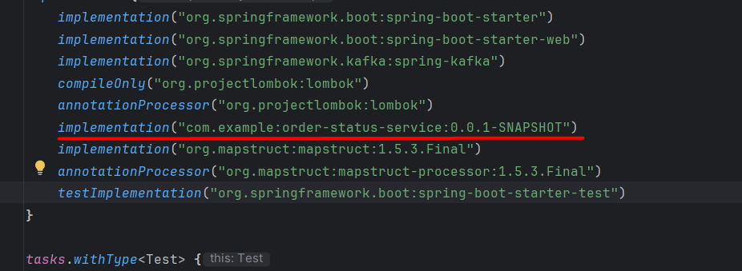

# Бронирование отелей

## Описание проекта
Приложение получает запрос о новом заказе по http и отправляет информацию о заказе в очередь kafka.
Слушатель события нового заказа реализован в проекте [order-status-service](https://github.com/i-kravchenko/order-status-service).
Для корректной передачи dto OrderEvent проект orders-status-service подключен в [build.gradle.kts](build.gradle.kts)


## Стэк используемых технологий
* Java
* Gradle
* Kafka
* Zookeeper

## Инструкция
### Конфигурация проекта
[Пример файла](src/main/resources/application.yaml)
#### Основные настройки
* spring.kafka.bootstrap-servers - адрес брокера Kafka

Остальные параметры можно оставить без изменений

### Сборка и запуск приложения
После того как приложение было сконфигурировано, его нужно собрать.
Для этого введите в терминале команду ниже:
```shell
gradle build bootJar
```
После завершение сборки можно запустить проект.
Для запуска kafka внутри docker подготовлен [скрипт](docker/docker-start.cmd)
Для запуска проекта нужно ввести следующую команду:
````shell
java -jar build/libs/order-service-0.0.1-SNAPSHOT.jar
````

